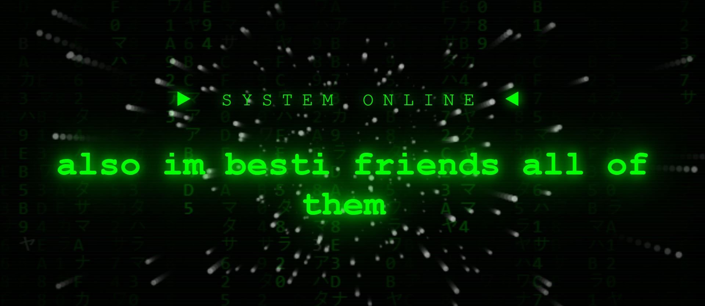

# ⚡ Typewriter ULTIMATE

A futuristic **Typewriter UI** with a Matrix-style background, flying 3D stars, typing sounds, glowing effects and an animated cursor.

This project is built with pure **HTML, CSS and JavaScript** without using any external library.

---

## 🚀 Demo

🔗 **Live Demo:**  
(https://negarlmd.github.io/typewriter-ultimate/)
---

## 📸 Preview



> Put your project screenshot inside:
>
> `src/images/preview.png`

---

## ✨ Features

- ⌨️ Typewriter text animation
- 🔄 Automatic text typing and deleting
- 🟢 Matrix digital rain effect
- ⭐ 3D flying stars animation
- 💻 Futuristic terminal style
- 🔊 Typing sound using Web Audio API
- 🗑️ Delete sound effect
- ✨ Neon green glow effects
- 📺 CRT scanline effect
- 🌑 Vignette effect
- 📳 Screen shake effect
- 💡 Blinking terminal cursor
- 📱 Responsive design
- 🚫 No external JavaScript libraries

---

## 🛠️ Technologies

- HTML5
- CSS3
- JavaScript
- Canvas API
- Web Audio API

---

## 📂 Project Structure

```text
typewriter-ultimate/
│
├── index.html
├── script.js
│
├── src/
│   ├── stylesheet.css
│   └── images/
│       └── preview.png
│
└── README.md
